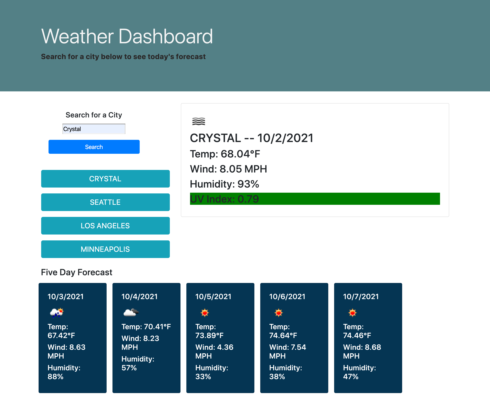

# Homework 6 - Weather Dashboard

## Objectives

Create a weather dashboard that displays the weather for a searched city. The weather includes today's date, a weather icon, the temperature, wind speed, humidity, and UV index. the UV Index displays green if conditions are favorable, yellow if conditions are moderate, and red if conditions are severe. Below, there is a five-day forecast that includes the future date, weather icon, temperature, wind speed, and humidity. Cities that have been searched appear as buttons upon page refresh and upon click, provide weather information. 

## Screenshot 

## Link to Deployed Page

[Here is a link to the deployed page.](https://erikaosterbur.github.io/weather-dashboard/)